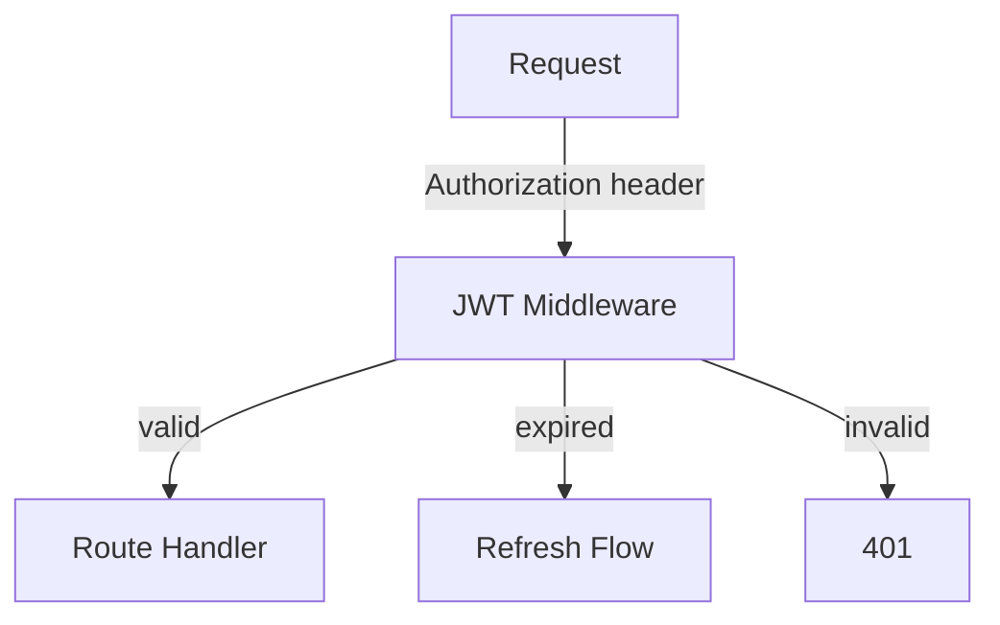

Map out and visualize:

$ARGUMENTS

## Granularity

Infer from topic breadth, or respect explicit flags (`--overview`/`--o`, `--detail`/`--d`):

| Level | When | Boxes contain | Arrows show |
|-------|------|---------------|-------------|
| **overview** | "this repo", "the auth system", broad scope | File paths, key exports | Dependencies, data direction |
| **component** | "how services interact", specific subsystem | Signatures, key logic lines | Data types, actions |
| **detail** | "how a login request flows", specific path | Real code snippets with file:line | Data transformations, conditions, branches |

## Investigation strategy

- **Overview**: launch 2-4 parallel Explore agents targeting different areas, then synthesize
- **Component/detail**: read files directly — no agents unless scope turns out wider than expected

## Output constraints

Produce **termrender directive markdown**, not raw text. Write it to `/tmp/map-output.md`, then render via `termrender` (or `termrender --tmux` when `--tmux` is present).

### Directive selection

- `:::panel` for component boxes — title includes name + file path (and line number at detail level)
- `:::tree` for hierarchies and dependency trees
- `:::columns` + `:::col` for side-by-side comparisons
- `:::callout{type="info"}` for architectural notes or gotchas
- ` ```mermaid ` flowcharts for data flows and labeled relationships between components
- GFM tables inside `:::panel` for tech stack summaries (overview level)
- `:::code{lang="..."}` for real code snippets (detail level)

### Color conventions

| Color | Meaning |
|-------|---------|
| `blue` | Core components |
| `cyan` | Data flow / trees |
| `green` | Entry points, public API |
| `yellow` | Configuration, environment |
| `magenta` | External dependencies |
| `gray` | Internal utilities |

### Example — component-level map

```
# Auth Subsystem

:::panel{title="JWT Middleware — src/middleware/auth.ts" color="green"}
Entry point for all authenticated routes.
Validates RS256 signature, checks expiry, attaches `req.user`.
:::



:::columns
:::col{width="50%"}
:::panel{title="Token Store — src/auth/store.ts" color="blue"}
Redis-backed session cache.
TTL matches JWT expiry.
:::
:::
:::col{width="50%"}
:::panel{title="Refresh — src/auth/refresh.ts" color="blue"}
Rotates refresh token on use.
Revokes old token family on reuse detection.
:::
:::
:::

:::callout{type="info"}
Refresh token rotation prevents replay attacks — if a stolen token is reused, the entire family is revoked.
:::
```

Do not narrate the investigation. The rendered diagram is the deliverable.
