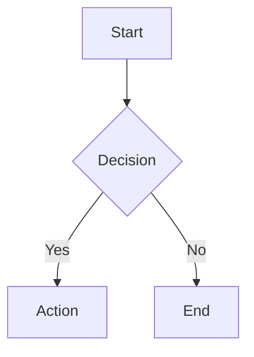
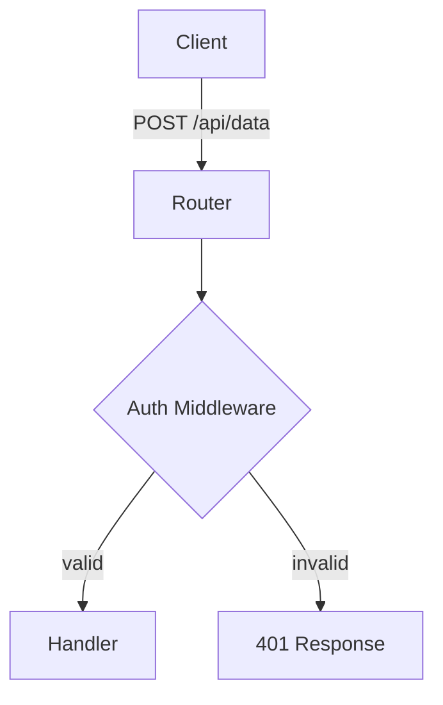

# termrender — Terminal Rendering Skill

Render directive-flavored markdown as rich ANSI terminal output using the `termrender` CLI.

## CLI Quick Reference

```
termrender <file>              Render a markdown file
termrender <file> --tmux       Render in a new tmux side pane
termrender -w 100 <file>       Render at specific column width
termrender --check <file>      Validate syntax without rendering
cat file.md | termrender       Render from stdin
```

## Directives

Every directive opens with `:::name{attrs}` and closes with `:::` (except `:::divider` which is self-closing). Directives nest arbitrarily — every opener needs a matching `:::`.

### Panel — bordered box
```
:::panel{title="Title" color="blue"}
Content here.
:::
```

### Columns — side-by-side layout
```
:::columns
:::col{width="50%"}
Left content.
:::
:::col{width="50%"}
Right content.
:::
:::
```

### Tree — hierarchical view
```
:::tree{color="cyan"}
Root
  Branch A
    Leaf 1
    Leaf 2
  Branch B
:::
```
Indentation (2 spaces) defines nesting depth.

### Callout — status box with icon
```
:::callout{type="info"}
Important note here.
:::
```
Types: `info`, `warning`, `error`, `success`

### Quote
```
:::quote{author="Author Name"}
Quoted text here.
:::
```

### Code — syntax highlighted
```
:::code{lang="python"}
def hello():
    print("world")
:::
```

### Divider — horizontal rule (self-closing, no `:::`)
```
:::divider{label="Section Break"}
```

### Mermaid — ASCII diagrams
````

````

## Standard Markdown

All GFM markdown works inside directives: headings, **bold**, *italic*, `code`, bullet/numbered lists, fenced code blocks, and GFM tables.

## Colors

Available for `panel` and `tree` color attrs:
`red`, `green`, `yellow`, `blue`, `magenta`, `cyan`, `white`, `gray`

## Rendering to tmux

`--tmux` opens a tmux split pane with rendered output — the diagram stays visible alongside the conversation. This is the preferred display method when the user is in tmux, because inline rendering gets buried by subsequent output.

Write to a temp file first, then render. Validate with `--check` if the document uses complex nesting.

## Complete Example

A well-structured termrender document combines multiple directives to tell a visual story:

```
# API Request Flow

:::panel{title="Client — src/client.ts:42" color="green"}
Sends authenticated requests via `fetchWithAuth()`.
Attaches JWT from session store.
:::



:::columns
:::col{width="50%"}
:::panel{title="Auth Middleware — src/middleware/auth.ts" color="blue"}
- Validates JWT signature
- Checks token expiry
- Attaches `req.user`
:::
:::
:::col{width="50%"}
:::panel{title="Data Handler — src/handlers/data.ts" color="blue"}
- Parses request body
- Validates with Zod schema
- Writes to Postgres
:::
:::
:::

:::callout{type="info"}
Auth middleware rejects before handler runs — no partial execution on invalid tokens.
:::

:::panel{title="Tech Stack" color="gray"}
| Layer | Technology |
|-------|-----------|
| Runtime | Node 20 + Express |
| Auth | JWT (RS256) |
| Validation | Zod |
| Database | PostgreSQL 16 |
:::
```
